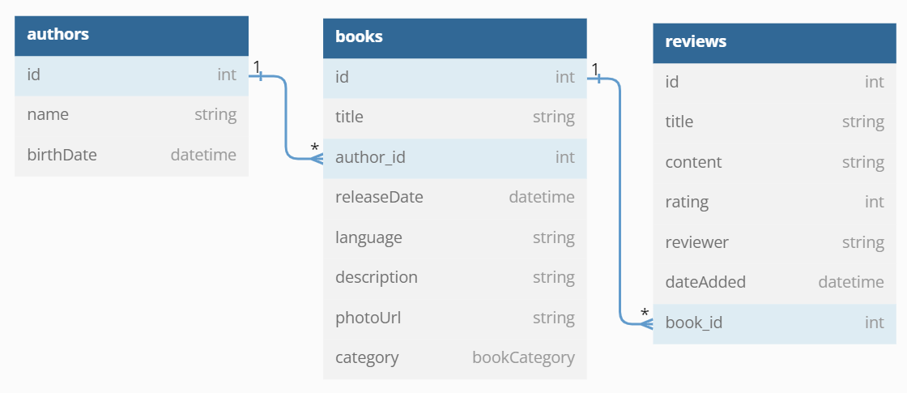

# BookCatalogue

### Projekt Programowanie Wizualne 2022

## 1. Encje

## 2. Metody:

### 2.1 BookDAO

- getAllBooks()
- getBooksByAuthor(author)
- getBooksByCategory(category)
- getBooksByLanguage(language)
- searchBooksByTitle(title)
- getBookById(id)
- addBook(book)
- updateBook(book)
- deleteBook(book)

### 2.2 AuthorDAO

- getAllAuthors()
- searchAuthorsByName(name)
- getAuthorById(id)
- addAuthor(author)
- updateAuthor(author)
- deleteAuthor(author)

### 2.3 ReviewDAO

- getReviewsByBook(bookId)
- getReviewsByRating(rating)
- getReviewById(id)
- addReview(review)
- updateReview(review)
- deleteReview(review)

## 3. API:

- GET /books?author=&category=&language=&title=
- GET /books/id
- POST /books/id
- PUT /books/id
- DELETE /books/id

- GET /authors?name=
- GET /authors/id
- POST /authors/id
- PUT /authors/id
- DELETE /authors/id

- GET /reviews?rating=
- GET /books/id/reviews?rating=
- GET /books/id/reviews/id
- POST /books/id/reviews/id
- PUT /books/id/reviews/id
- DELETE /books/id/reviews/id
